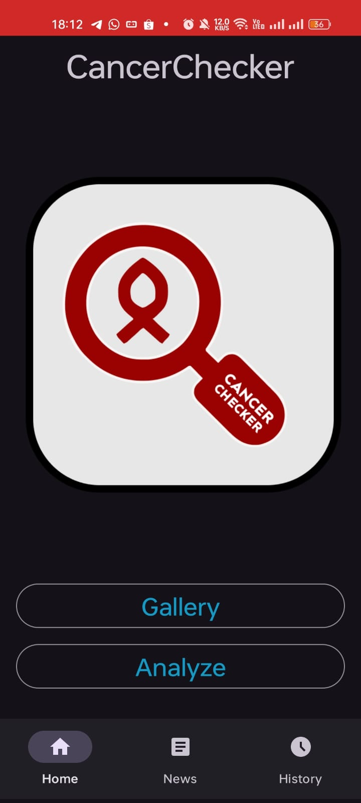
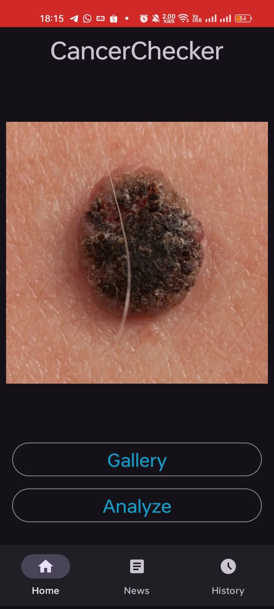
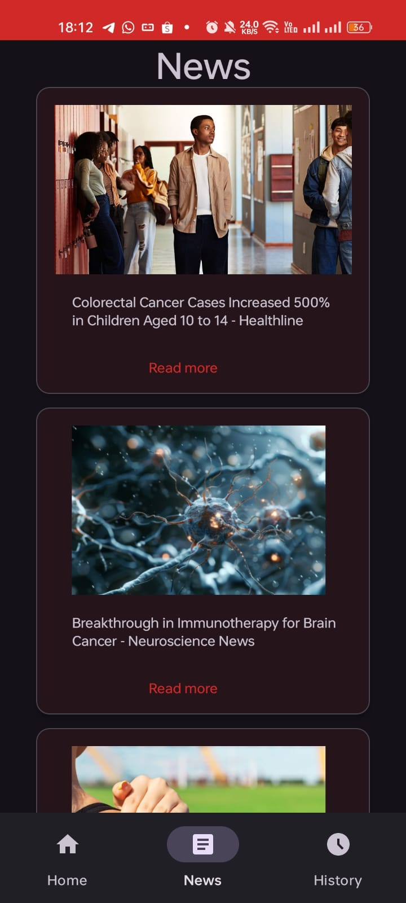
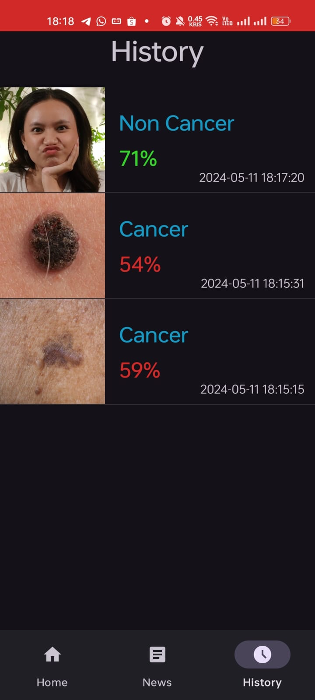
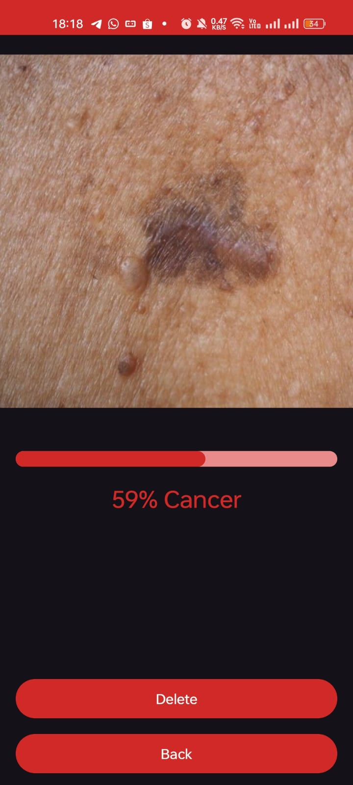

# Cancer Checker App
**Thanks** to **Dicoding Indonesia** for providing the "Belajar Penerapan Machine Learning untuk Android" class and **Bangkit Academy** for giving me access to finish this class. This is my final submission for this class.

### App Layout

### App Features
- Using Starter Project by Dicoding
- Cropping & Rotating Image Features
- Feature Capture Image from the Gallery and Display it
- Using Tensorflow Lite Machine Learning Model to Predict Images
- Display the news page obtained from the News API
- Displaying the History Features of the Prediction that has been saved

### Dependencies
- [Lifecycle & Livedata](https://developer.android.com/jetpack/androidx/releases/lifecycle)
- [ViewModel](https://developer.android.com/topic/libraries/architecture/viewmodel)
- [Retrofit 2](https://square.github.io/retrofit/)    
- [OkHttp 3](https://square.github.io/okhttp/)    
- [Glide](https://github.com/bumptech/glide)    
- [AndroidX](https://mvnrepository.com/artifact/androidx)
- [KotlinX Coroutines](https://developer.android.com/kotlin/coroutines)
- [Circle ImageView](https://github.com/hdodenhof/CircleImageView)
- [Lottie Android](https://github.com/airbnb/lottie-android)
- [RoomDatabase](https://developer.android.com/reference/android/arch/persistence/room/RoomDatabase)
- [DataStore](https://developer.android.com/topic/libraries/architecture/datastore)
- [ViewBinding](https://developer.android.com/topic/libraries/view-binding)
- [UCrop](https://github.com/Yalantis/uCrop)
- [Tensorflow Lite](https://central.sonatype.com/artifact/org.tensorflow/tensorflow-lite-task-vision)
