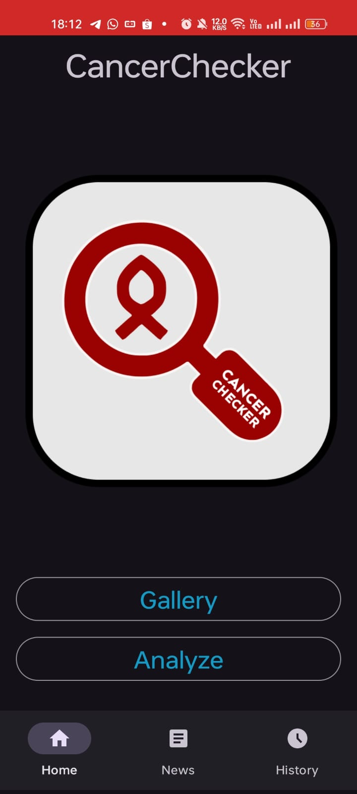
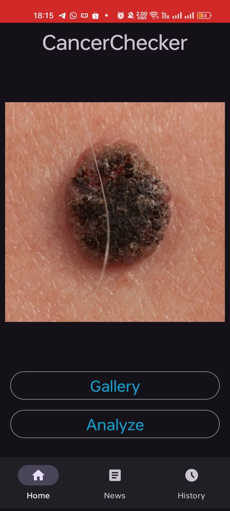
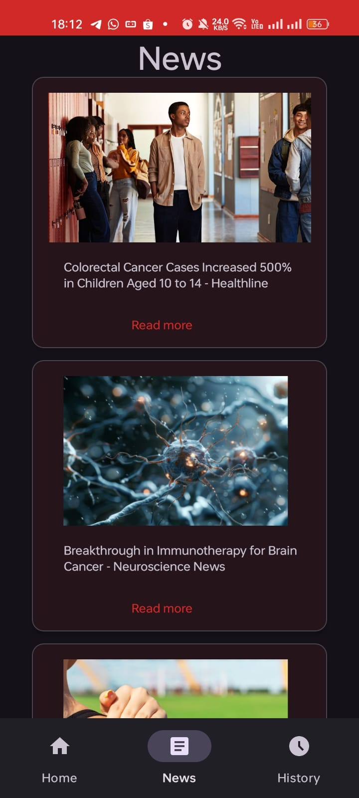
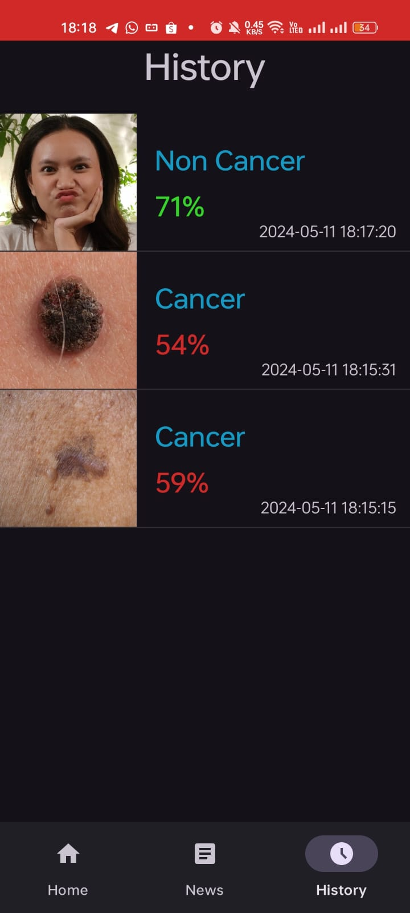
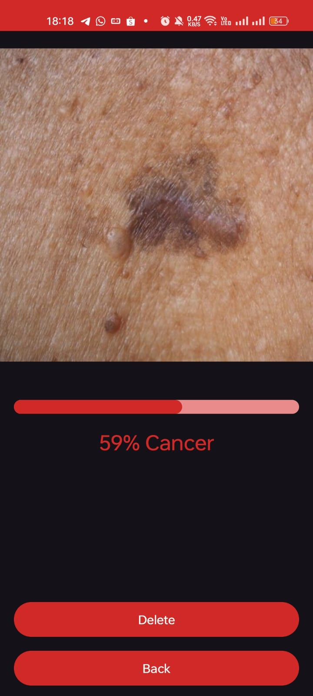

# Cancer Checker App
**Thanks** to **Dicoding Indonesia** for providing the "Belajar Penerapan Machine Learning untuk Android" class and **Bangkit Academy** for giving me access to finish this class. This is my final submission for this class. 

## App Layout

    
    
    
    
    
    

 

## App Features
- Using Starter Project by Dicoding
- Cropping & Rotating Image Features
- Feature Capture Image from the Gallery and Display it
- Using Tensorflow Lite Machine Learning Model to Predict Images
- Display the news page obtained from the News API
- Displaying the History Features of the Prediction that has been saved 

## Dependencies
- [Lifecycle & Livedata](https://developer.android.com/jetpack/androidx/releases/lifecycle): Observing Android component lifecycles and managing continuous data flow.
- [ViewModel](https://developer.android.com/topic/libraries/architecture/viewmodel): Storing and managing UI-related data in a lifecycle-conscious way.
- [Retrofit 2](https://square.github.io/retrofit/): Making HTTP requests to RESTful APIs in a simple and efficient way on Android.
- [OkHttp 3](https://square.github.io/okhttp/): Efficient and reliable HTTP client for Android, used by Retrofit for making HTTP network calls.
- [Glide](https://github.com/bumptech/glide): Library for smoothly and efficiently displaying images on Android.
- [AndroidX](https://mvnrepository.com/artifact/androidx): Package of libraries and tools that provide a range of features for Android app development.
- [KotlinX Coroutines](https://developer.android.com/kotlin/coroutines): Kotlin library for writing asynchronous code in a clean, sequential style.
- [Circle ImageView](https://github.com/hdodenhof/CircleImageView): ImageView that makes it easy to display images in a circular shape on Android.
- [Lottie Android](https://github.com/airbnb/lottie-android): Library for easily adding animations to Android apps using JSON files created in Adobe After Effects.
- [RoomDatabase](https://developer.android.com/reference/android/arch/persistence/room/RoomDatabase): Library for local data storage on Android, based on the SQLite database architecture.
- [DataStore](https://developer.android.com/topic/libraries/architecture/datastore): Replaces SharedPreferences, providing a secure and asynchronous data storage system using a standard protocol.
- [ViewBinding](https://developer.android.com/topic/libraries/view-binding): Allows binding of Android UI components to code via the IDs present in layout files.
- [UCrop](https://github.com/Yalantis/uCrop): Library for performing image cropping in Android apps with a user-friendly interface.
- [Tensorflow Lite](https://central.sonatype.com/artifact/org.tensorflow/tensorflow-lite-task-vision): Machine learning framework used for building, testing, and deploying ML models efficiently on Android devices.

